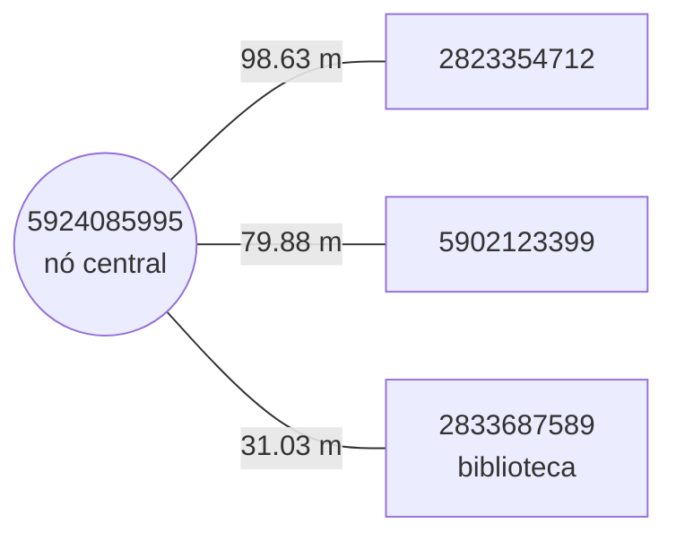
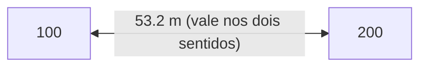
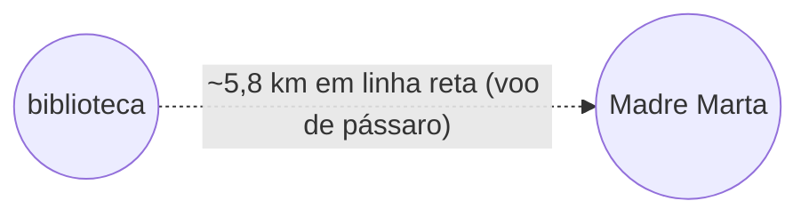
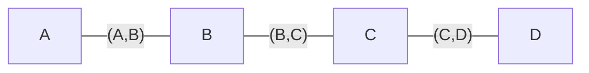
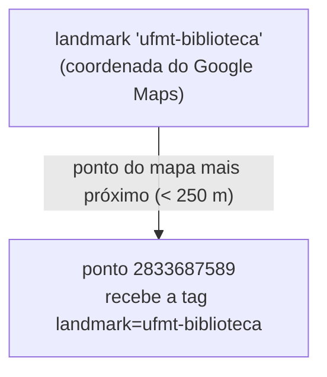
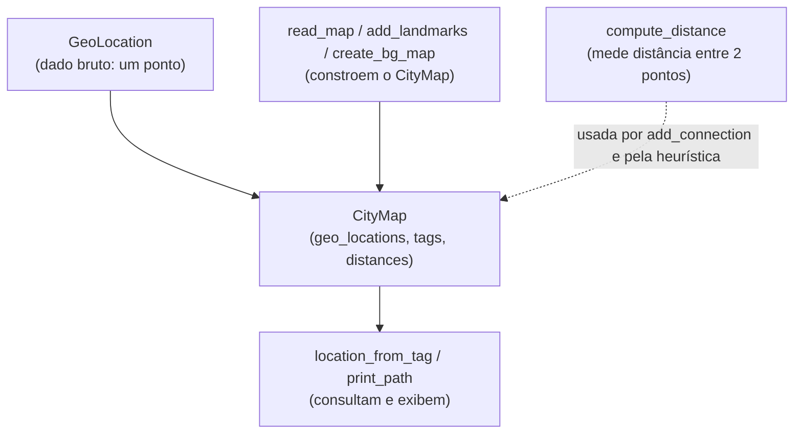
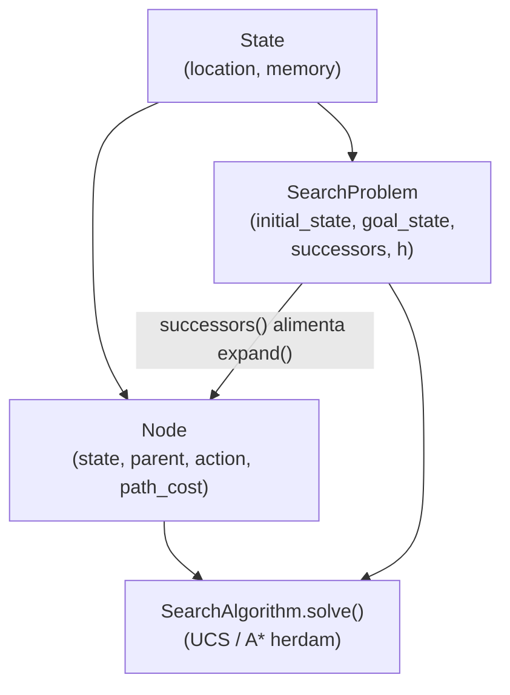
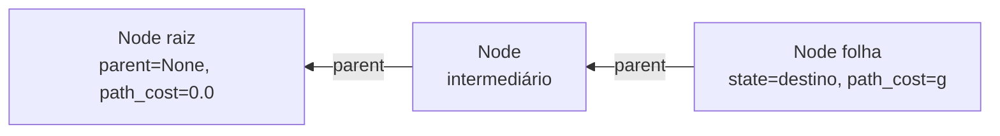
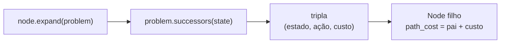

# Guia do `map_util.py`

Este arquivo transforma um mapa do OpenStreetMap (`.pbf`) em estruturas de dados Python prontas para os algoritmos de busca (UCS e A\*). Ele responde a três perguntas sobre a cidade:

- **Onde** cada local fica? → `GeoLocation`
- **O que** cada local é? → tags
- **Quais** locais se conectam e a que distância? → o grafo (`distances`)

A ordem de dependência é: `GeoLocation` (dado bruto) → `CityMap` (organiza os dados) → funções (constroem e consultam o mapa).

> **Observação sobre os exemplos:** todos os labels abaixo foram conferidos rodando o código com o mapa real de Barra do Garças. O label da biblioteca da UFMT é `2833687589`.

---

## Classe `GeoLocation`

Representa **um ponto na superfície da Terra**. É a peça mais básica do arquivo.

### Atributos
| Atributo | Tipo | Significado |
|----------|------|-------------|
| `latitude` | `float` | Coordenada norte–sul |
| `longitude` | `float` | Coordenada leste–oeste |

### Métodos
- `__init__(self, latitude, longitude)` — guarda as duas coordenadas.
- `__repr__(self)` — define como o objeto aparece ao ser impresso, no formato `latitude,longitude`.

### Exemplo
```python
g = GeoLocation(-15.8750393, -52.3119392)

g.latitude    # -15.8750393
g.longitude   # -52.3119392
print(g)      # -15.8750393,-52.3119392
```

### Como se conecta ao resto
É o "par de coordenadas" que circula por todo o sistema: o `CityMap` guarda uma `GeoLocation` por local, e `compute_distance` recebe duas delas para medir distância.

---

## Classe `CityMap`

Representa **o mapa inteiro** da cidade. Não faz cálculos pesados; apenas organiza os dados em **três dicionários** (atributos criados no `__init__`).

### Atributos

#### 1. `geo_locations: dict[str, GeoLocation]`
Mapeia o **label** de um local para a sua **coordenada**.

```python
city_map.geo_locations["2833687589"]
# GeoLocation(-15.875..., -52.311...)
```

#### 2. `tags: dict[str, list[str]]`  *(é um `defaultdict(list)`)*
Mapeia o label para a **lista de tags** que descrevem o local. Por ser `defaultdict(list)`, pedir um label inexistente devolve `[]` em vez de erro.

```python
city_map.tags["2833687589"]
# ['label=2833687589', 'landmark=ufmt-biblioteca']
```

#### 3. `distances: dict[str, dict[str, float]]`  *(é um `defaultdict(dict)`)*
O **grafo**. Para cada local, devolve um dicionário `{vizinho: distância_em_metros}`.

```python
city_map.distances["5924085995"]
# {
#   "2823354712": 98.63,
#   "5902123399": 79.88,
#   "2833687589": 31.03
# }
```

Visualmente, isso é um nó central ligado aos seus vizinhos diretos:



Só aparecem os vizinhos **diretos** (ligados por uma única rua). Caminhos longos não estão prontos aqui — é o algoritmo de busca que vai saltando de vizinho em vizinho.

### Métodos

#### `add_location(self, label, location, tags)`
Registra um novo local. Acrescenta automaticamente uma tag `label=...` no início da lista e usa um `assert` para impedir registrar o mesmo label duas vezes.

```python
city_map.add_location("100", GeoLocation(-15.87, -52.31), ["amenity=food"])

city_map.tags["100"]
# ['label=100', 'amenity=food']   <- o "label=100" entrou sozinho
```

#### `add_connection(self, source, target, distance=None)`
Cria uma aresta entre dois locais. Se você não passar `distance`, ele calcula sozinho via `compute_distance`. Preenche os **dois sentidos** — por isso o grafo é não-direcionado.

```python
city_map.add_connection("100", "200")   # distância calculada automaticamente

city_map.distances["100"]["200"]   # ex.: 53.2
city_map.distances["200"]["100"]   # 53.2  (mesmo valor, sentido inverso)
```



### Como se conecta ao resto
É construído pela função `read_map` e consumido por quase tudo: `ShortestPathProblem` usa `distances` (sucessores) e `geo_locations` (heurística do A\*); a visualização usa os três dicionários.

---

## Função `compute_distance`

Calcula a distância **em linha reta** (em metros) entre duas `GeoLocation`, usando a **fórmula de Haversine** — a versão "esférica" da distância euclidiana, já que a Terra é curva.

```python
a = GeoLocation(-15.8750393, -52.3119392)  # biblioteca UFMT
b = GeoLocation(-15.8897132, -52.2593536)  # escola Madre Marta

compute_distance(a, b)
# ~5800.0  (≈ 5,8 km em linha reta)
```



### Importância
Tem dois usos centrais:
1. `add_connection` a usa para preencher as distâncias do grafo ao ler o mapa.
2. É a base da **heurística `h(...)` do A\***: a distância em linha reta nunca superestima a distância real andando pelas ruas, o que torna a heurística **admissível** (garante caminho ótimo).

---

## Função `read_map` + classe interna `MapCreationHandler`

A parte mais complexa. `read_map` lê o `.pbf` e devolve um `CityMap` pronto, usando a biblioteca **osmium**. O osmium oferece a classe `SimpleHandler`: você herda dela e define métodos que são chamados **automaticamente** para cada elemento do arquivo.

A classe interna `MapCreationHandler(osmium.SimpleHandler)` é esse "ouvinte".

### Atributos do handler
| Atributo | Conteúdo |
|----------|----------|
| `self.nodes` | coordenadas de cada nó encontrado |
| `self.tags` | tags de cada nó |
| `self.edges` | conjunto de pares `(origem, destino)` conectados |

### Métodos chamados pelo osmium
- `node(self, n)` — chamado para cada **ponto** do mapa; guarda as tags daquele nó.
- `way(self, w)` — chamado para cada **caminho** (rua, trilha). Há um filtro importante: descarta vias onde não se anda a pé (autoestradas, ou vias com `foot=no`/`pedestrian=no`). Nas vias que sobram, percorre os nós em sequência e cria uma aresta entre cada par consecutivo.

Uma "way" com 4 nós vira 3 arestas:



Quando o osmium termina de ler o arquivo, `read_map` transfere tudo para um `CityMap` (nós viram locais; arestas viram conexões).

### Importância
É o que dá vida ao `CityMap`. Você não chama `read_map` diretamente no Problema 1 — chama `create_bg_map`, que a usa por baixo dos panos.

---

## Função `add_landmarks`

O mapa do OSM tem milhares de pontos com labels numéricos sem significado. Os nomes legíveis (biblioteca, prefeitura, etc.) estão no `bg-landmarks.json` com coordenadas do Google Maps, que quase nunca batem exatamente com um ponto do mapa. Essa função resolve o problema: para cada landmark, encontra o ponto do mapa **mais próximo** (dentro de uma tolerância de 250 m) e cola a tag nele.



```python
# resultado prático:
city_map.tags["2833687589"].append("landmark=ufmt-biblioteca")
```

### Importância
É graças a ela que `location_from_tag("landmark=ufmt-biblioteca", ...)` consegue achar um label de partida. Sem ela, você só teria números.

---

## Função `location_from_tag`

Faz o caminho inverso de uma consulta: dada uma **tag**, devolve o **label** do local que a possui (o menor em ordem alfabética, se houver vários).

```python
location_from_tag("landmark=madre-marta", city_map)
# "2804473802"

location_from_tag("amenity=food", city_map)
# o primeiro local marcado como comida
```

### Importância
É a ponte entre "nome humano" e "label do grafo". No `trab-parte1.py`, é ela que produz o `start` e o `end` passados ao `ShortestPathProblem`.

---

## Funções de saída e conveniência

### `print_path(path, waypoint_tags, city_map, out_path="path.json")`
Recebe um caminho (lista de labels), imprime as tags de cada local e, opcionalmente, grava o `path.json` usado pela visualização.

### `print_map(city_map)`
Ferramenta de depuração: imprime todos os locais, suas tags e suas conexões.

### `create_bg_map() -> CityMap`
A função que você de fato chama. Junta `read_map` + `add_landmarks` em uma linha. É o **ponto de entrada**: uma chamada e você recebe o mapa completo de Barra do Garças, com grafo e landmarks prontos.

```python
def create_bg_map():
    city_map = read_map("data/barra-do-garcas.pbf")
    add_landmarks(city_map, "data/bg-landmarks.json")
    return city_map
```

---

## Como tudo se encaixa (fluxo do Problema 1)

```python
city_map = create_bg_map()                                       # read_map + add_landmarks
start = location_from_tag("landmark=ufmt-biblioteca", city_map)  # nome -> label
end   = location_from_tag("landmark=madre-marta", city_map)      # nome -> label

problem = ShortestPathProblem(start, end, city_map)              # usa distances/geo_locations
ucs = UniformCostSearch()
ucs.solve(problem)

print_path([start] + ucs.actions, [], city_map)                  # grava path.json
plot_map(city_map, [start] + ucs.actions, [], "...")             # visualiza
```


# Guia do `search_base.py`
 
Enquanto o `map_util.py` cuida dos **dados** (o mapa), o `search_base.py` define o **maquinário genérico de busca**: as classes-base que UCS e A\* usam. Nenhum algoritmo é implementado aqui — o arquivo só estabelece os contratos e as estruturas. São quatro classes:
 
- `State` — a unidade de estado (o que a busca compara e usa como chave).
- `SearchProblem` — o contrato de um problema (início, objetivo, sucessores, heurística).
- `Node` — um vértice da árvore de busca (estado + histórico + custo).
- `SearchAlgorithm` — a interface comum que UCS e A\* implementam.

 
---
 
## Classe `State`
 
Encapsula um estado do espaço de busca. A identidade do estado é composta por dois campos: `location` (`str`) e `memory` (`frozenset`).
 
### Atributos
| Atributo | Tipo | Significado |
|----------|------|-------------|
| `location` | `str` | "onde estou" — no trabalho, o label do nó do mapa |
| `memory` | `frozenset` | informação extra cumprida pelo estado (vazia no Problema 1) |
 
### Construtor
 
```python
def __init__(self, location: str, memory: frozenset=None):
    self.location = location
    self.memory = memory if memory is not None else frozenset()
```
 
O default de `memory` é resolvido **no corpo** (via `None`), não na assinatura. Isso evita o problema clássico do *mutable default argument* (um objeto default único compartilhado entre todas as chamadas) e é a forma idiomática em Python.
 
### Métodos especiais
 
```python
def __hash__(self):
    return hash((self.location, self.memory))
 
def __eq__(self, other):
    return (self.location, self.memory) == (other.location, other.memory)
```
 
A classe é **hashable** porque depende apenas de campos imutáveis (`str` e `frozenset` são hashable; `set` e `list` não). O `__hash__` é o que permite usar `State` como **chave de dicionário** — exatamente o que a tabela `reached` dos algoritmos exige. Em Python, definir `__eq__` sem `__hash__` torna o objeto *unhashable*; por isso os dois coexistem e derivam da mesma tupla `(location, memory)`, mantendo o contrato `a == b ⟹ hash(a) == hash(b)`.
 
```python
State("100") == State("100")                     # True
State("100") == State("200")                     # False
State("100", frozenset({"x"})) == State("100")   # False (memory diferente)
 
print(State("100"))
# State(location='100', memory=frozenset())
```
 
### O papel do `memory`
 
O `memory` entra na **definição de igualdade** do estado. A pergunta que ele responde é: *o que faz duas situações serem "o mesmo estado" para a busca?*
 
**Problema 1 (memory vazio):** como `memory` é sempre `frozenset()`, quem decide a igualdade é só a `location`. "Estar no local X" é um único estado, independentemente de como se chegou nele — o comportamento correto para caminho mais curto.
 
**Problema 2 (memory em uso):** quando há pontos de passagem obrigatórios, "estar no local X" deixa de ser único. Considere a tarefa "passar pelo Banco do Brasil antes do destino":
 
```python
State("X", frozenset())                  # no local X, banco NÃO visitado
State("X", frozenset({"banco_brasil"}))  # no local X, banco JÁ visitado
```
 
Pelo `__eq__`, esses dois **não são iguais** (mesma `location`, `memory` diferente), então a busca os trata como estados distintos. Sem isso, o algoritmo poderia descartar a versão que ainda precisa cumprir a tarefa.
 
Por que `frozenset` especificamente:
1. Precisa ser **hashable** para entrar no `__hash__` (um `set`/`list` mutável daria erro ao virar chave).
2. **Ignora ordem**: `frozenset({"a", "b"}) == frozenset({"b", "a"})` — importa *quais* tarefas foram cumpridas, não em que ordem.
### Como se conecta ao resto
`State` aparece em todos os outros pontos: `SearchProblem` guarda início e objetivo como `State`; `Node` embrulha um `State`; e a tabela `reached` usa `State` como chave (via `__hash__`/`__eq__`).
 
---
 
## Classe `SearchProblem`
 
Classe base que define a interface de um problema de busca. Marca os pontos de extensão com `NotImplementedError`. O `ShortestPathProblem` herda dela e preenche os detalhes.
 
### Atributos
| Atributo | Tipo | Significado |
|----------|------|-------------|
| `initial_state` | `State` | estado de partida |
| `goal_state` | `State` | estado objetivo |
 
### Métodos concretos (já funcionais na base)
 
```python
def get_initial_state(self) -> State:
    return self.initial_state
 
def is_goal(self, state: State) -> bool:
    return state == self.goal_state
```
 
`is_goal` delega ao `__eq__` de `State`, por isso funciona sem ser sobrescrito. No Problema 2, isso se adapta sozinho: atingir o objetivo passará a exigir não só a `location` certa, mas também a `memory` correta (todos os waypoints visitados).
 
### Métodos de extensão (contratos a implementar)
 
```python
def successors(self, state: State) -> Iterator[tuple[State, str, float]]:
    raise NotImplementedError("Override me")
 
def h(self, state: State) -> float:
    raise NotImplementedError("Override me")
```
 
`successors` retorna um **iterador de triplas** `(estado, ação, custo)` — a anotação `Iterator` indica uso de `yield`. `h` é a heurística, exercitada apenas por buscas informadas. O `NotImplementedError` é uma exceção *runtime*: Python não força a implementação no carregamento da classe (diferente de `@abstractmethod`); o erro só aparece se o método for chamado sem ter sido sobrescrito.
 
> Consequência prática: um `ShortestPathProblem` sem `h` rodaria com UCS (que nunca chama `h`) e quebraria com A\* (que chama).
 
### Como se conecta ao resto
É o objeto passado para `algoritmo.solve(problem)`. Os algoritmos usam `get_initial_state` (início), `is_goal` (parada), `successors` (expansão) e `h` (A\*). Os dois métodos com `NotImplementedError` são os "buracos" que a subclasse preenche.
 
---
 
## Classe `Node`
 
Representa um vértice da árvore de busca. Diferencia-se de `State` por carregar o **contexto de derivação**: o estado, o nó pai, a ação aplicada e o custo acumulado.
 
### Atributos
| Atributo | Significado |
|----------|-------------|
| `state` | o `State` que este nó representa |
| `parent` | o nó pai (`None` na raiz) |
| `action` | a ação que levou do pai até aqui (`None` na raiz) |
| `path_cost` | `g(n)` — custo real acumulado da raiz até aqui |
 
```python
raiz = Node(State("100"))
raiz.parent      # None
raiz.action      # None
raiz.path_cost   # 0.0
 
filho = Node(State("200"), parent=raiz, action="200", path_cost=53.2)
filho.parent     # raiz
filho.path_cost  # 53.2
```
 
A estrutura forma uma **lista ligada invertida**: cada nó referencia seu predecessor via `parent`, terminando em `None`. Não há referência dos pais para os filhos.
 

 
### Reconstrução do caminho
 
```python
def path_actions(self) -> list[str]:
    actions = []
    node = self
    while node.parent is not None:
        actions.append(node.action)
        node = node.parent
    actions.reverse()
    return actions
```
 
Sobe pela cadeia de `parent` acumulando `action` e para na raiz (`parent is None`). O `reverse()` corrige a ordem (a coleta vai da folha para a raiz). Complexidade O(d), com `d` = profundidade.
 
`path_states` é análogo, mas a condição é `while node is not None` (inclui a raiz, cujo estado faz parte do caminho):
 
```python
filho.path_states()
# [State("100"), State("200")]
```
 
> A diferença `parent is not None` (ações) vs `node is not None` (estados) reflete que um caminho de **n** nós tem **n** estados mas **n-1** ações — a raiz tem estado, mas não tem ação de chegada.
 
### Expansão
 
```python
def expand(self, problem: SearchProblem):
    for state, action, cost in problem.successors(self.state):
        yield Node(state, self, action, self.path_cost + cost)
```
 
Para cada tripla de `successors`, instancia um `Node` filho com `self` como `parent` e `path_cost = self.path_cost + cost`. Essa soma é onde o `g` se propaga incrementalmente pela árvore. Por ser gerador (`yield`), os filhos são produzidos sob demanda.
 

 
### Como se conecta ao resto
O `Node` é o que vive na fronteira (`PriorityQueue`) e na tabela `reached`. O algoritmo retira nós da fronteira, testa o `state` com `is_goal` e, ao achar o objetivo, chama `path_actions()`/`path_states()`. O `path_cost` é a prioridade na UCS (`g`) e a base do `f = g + h` no A\*.
 
---
 
## Classe `SearchAlgorithm`
 
Interface mínima para algoritmos de busca. Um único método de contrato:
 
```python
class SearchAlgorithm:
    def solve(self, search_problem: SearchProblem) -> None:
        raise NotImplementedError("Override me")
```
 
Define o **polimorfismo** entre `UniformCostSearch` e `AStar`: ambos herdam e implementam `solve`. Como o retorno é `None`, o padrão é **efeito colateral em atributos de instância** (`self.actions`, `self.path_cost`, etc.) — o cliente lê os resultados nos campos do objeto após o `solve`. É por isso que um `return self` dentro do `solve` é inócuo (o retorno é descartado) e por que dá para trocar `UniformCostSearch()` por `AStar()` no `trab-parte1.py` sem mexer em mais nada.
 
---
 
## Como tudo se encaixa (ciclo de vida da busca)
 
```python
# 1. Define o problema (SearchProblem -> ShortestPathProblem)
problem = ShortestPathProblem(start, end, city_map)
 
# 2. O algoritmo começa pelo estado inicial, embrulhado num Node
node = Node(problem.get_initial_state())
 
# 3. Repete: tira um nó, testa objetivo, expande
while not frontier.is_empty():
    node = frontier.pop()
    if problem.is_goal(node.state):        # aciona State.__eq__
        return node.path_actions()         # reconstrói subindo os parents
    for child in node.expand(problem):     # expand chama successors e propaga g
        s = child.state
        if s not in reached or child.path_cost < reached[s].path_cost:
            reached[s] = child             # reached usa State como chave (State.__hash__)
            frontier.push(child)
```
 
Responsabilidades disjuntas das quatro classes:
 
| Classe | Responsabilidade |
|--------|------------------|
| `State` | identidade hashable (igualdade + hash a partir de `location` e `memory`) |
| `SearchProblem` | topologia (`successors`), parada (`is_goal`), estimativa (`h`) |
| `Node` | árvore de derivação (`parent`/`action`) e propagação de custo (`path_cost`) |
| `SearchAlgorithm` | interface comum de resolução (`solve`) |
 
A diferença entre UCS e A\* fica isolada inteiramente na função `key` da `PriorityQueue` — `g(n)` versus `g(n) + h(n)` — sem qualquer alteração nessas quatro classes base.
 
