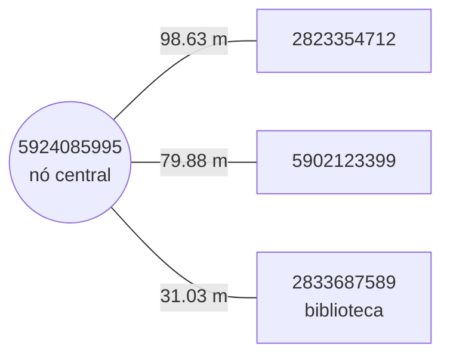
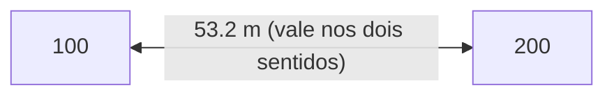
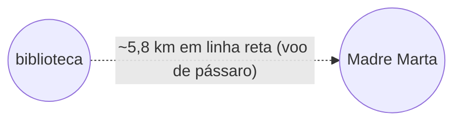
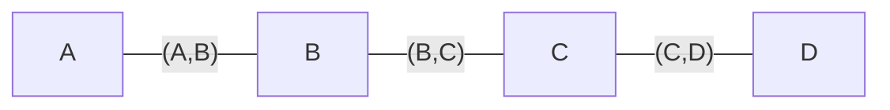
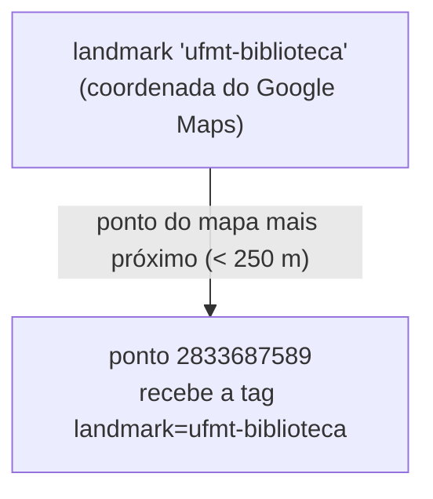
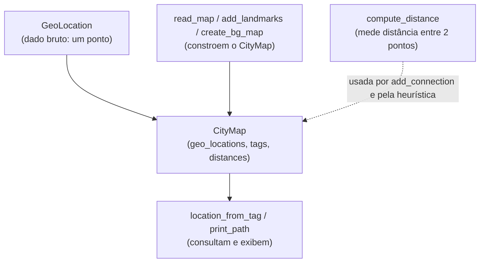

# Guia do `map_util.py`

Este arquivo transforma um mapa do OpenStreetMap (`.pbf`) em estruturas de dados Python prontas para os algoritmos de busca (UCS e A\*). Ele responde a três perguntas sobre a cidade:

- **Onde** cada local fica? → `GeoLocation`
- **O que** cada local é? → tags
- **Quais** locais se conectam e a que distância? → o grafo (`distances`)

A ordem de dependência é: `GeoLocation` (dado bruto) → `CityMap` (organiza os dados) → funções (constroem e consultam o mapa).

> **Observação sobre os exemplos:** todos os labels abaixo foram conferidos rodando o código com o mapa real de Barra do Garças. O label da biblioteca da UFMT é `2833687589`.

---

## Classe `GeoLocation`

Representa **um ponto na superfície da Terra**. É a peça mais básica do arquivo.

### Atributos
| Atributo | Tipo | Significado |
|----------|------|-------------|
| `latitude` | `float` | Coordenada norte–sul |
| `longitude` | `float` | Coordenada leste–oeste |

### Métodos
- `__init__(self, latitude, longitude)` — guarda as duas coordenadas.
- `__repr__(self)` — define como o objeto aparece ao ser impresso, no formato `latitude,longitude`.

### Exemplo
```python
g = GeoLocation(-15.8750393, -52.3119392)

g.latitude    # -15.8750393
g.longitude   # -52.3119392
print(g)      # -15.8750393,-52.3119392
```

### Como se conecta ao resto
É o "par de coordenadas" que circula por todo o sistema: o `CityMap` guarda uma `GeoLocation` por local, e `compute_distance` recebe duas delas para medir distância.

---

## Classe `CityMap`

Representa **o mapa inteiro** da cidade. Não faz cálculos pesados; apenas organiza os dados em **três dicionários** (atributos criados no `__init__`).

### Atributos

#### 1. `geo_locations: dict[str, GeoLocation]`
Mapeia o **label** de um local para a sua **coordenada**.

```python
city_map.geo_locations["2833687589"]
# GeoLocation(-15.875..., -52.311...)
```

#### 2. `tags: dict[str, list[str]]`  *(é um `defaultdict(list)`)*
Mapeia o label para a **lista de tags** que descrevem o local. Por ser `defaultdict(list)`, pedir um label inexistente devolve `[]` em vez de erro.

```python
city_map.tags["2833687589"]
# ['label=2833687589', 'landmark=ufmt-biblioteca']
```

#### 3. `distances: dict[str, dict[str, float]]`  *(é um `defaultdict(dict)`)*
O **grafo**. Para cada local, devolve um dicionário `{vizinho: distância_em_metros}`.

```python
city_map.distances["5924085995"]
# {
#   "2823354712": 98.63,
#   "5902123399": 79.88,
#   "2833687589": 31.03
# }
```

Visualmente, isso é um nó central ligado aos seus vizinhos diretos:



Só aparecem os vizinhos **diretos** (ligados por uma única rua). Caminhos longos não estão prontos aqui — é o algoritmo de busca que vai saltando de vizinho em vizinho.

### Métodos

#### `add_location(self, label, location, tags)`
Registra um novo local. Acrescenta automaticamente uma tag `label=...` no início da lista e usa um `assert` para impedir registrar o mesmo label duas vezes.

```python
city_map.add_location("100", GeoLocation(-15.87, -52.31), ["amenity=food"])

city_map.tags["100"]
# ['label=100', 'amenity=food']   <- o "label=100" entrou sozinho
```

#### `add_connection(self, source, target, distance=None)`
Cria uma aresta entre dois locais. Se você não passar `distance`, ele calcula sozinho via `compute_distance`. Preenche os **dois sentidos** — por isso o grafo é não-direcionado.

```python
city_map.add_connection("100", "200")   # distância calculada automaticamente

city_map.distances["100"]["200"]   # ex.: 53.2
city_map.distances["200"]["100"]   # 53.2  (mesmo valor, sentido inverso)
```



### Como se conecta ao resto
É construído pela função `read_map` e consumido por quase tudo: `ShortestPathProblem` usa `distances` (sucessores) e `geo_locations` (heurística do A\*); a visualização usa os três dicionários.

---

## Função `compute_distance`

Calcula a distância **em linha reta** (em metros) entre duas `GeoLocation`, usando a **fórmula de Haversine** — a versão "esférica" da distância euclidiana, já que a Terra é curva.

```python
a = GeoLocation(-15.8750393, -52.3119392)  # biblioteca UFMT
b = GeoLocation(-15.8897132, -52.2593536)  # escola Madre Marta

compute_distance(a, b)
# ~5800.0  (≈ 5,8 km em linha reta)
```



### Importância
Tem dois usos centrais:
1. `add_connection` a usa para preencher as distâncias do grafo ao ler o mapa.
2. É a base da **heurística `h(...)` do A\***: a distância em linha reta nunca superestima a distância real andando pelas ruas, o que torna a heurística **admissível** (garante caminho ótimo).

---

## Função `read_map` + classe interna `MapCreationHandler`

A parte mais complexa. `read_map` lê o `.pbf` e devolve um `CityMap` pronto, usando a biblioteca **osmium**. O osmium oferece a classe `SimpleHandler`: você herda dela e define métodos que são chamados **automaticamente** para cada elemento do arquivo.

A classe interna `MapCreationHandler(osmium.SimpleHandler)` é esse "ouvinte".

### Atributos do handler
| Atributo | Conteúdo |
|----------|----------|
| `self.nodes` | coordenadas de cada nó encontrado |
| `self.tags` | tags de cada nó |
| `self.edges` | conjunto de pares `(origem, destino)` conectados |

### Métodos chamados pelo osmium
- `node(self, n)` — chamado para cada **ponto** do mapa; guarda as tags daquele nó.
- `way(self, w)` — chamado para cada **caminho** (rua, trilha). Há um filtro importante: descarta vias onde não se anda a pé (autoestradas, ou vias com `foot=no`/`pedestrian=no`). Nas vias que sobram, percorre os nós em sequência e cria uma aresta entre cada par consecutivo.

Uma "way" com 4 nós vira 3 arestas:



Quando o osmium termina de ler o arquivo, `read_map` transfere tudo para um `CityMap` (nós viram locais; arestas viram conexões).

### Importância
É o que dá vida ao `CityMap`. Você não chama `read_map` diretamente no Problema 1 — chama `create_bg_map`, que a usa por baixo dos panos.

---

## Função `add_landmarks`

O mapa do OSM tem milhares de pontos com labels numéricos sem significado. Os nomes legíveis (biblioteca, prefeitura, etc.) estão no `bg-landmarks.json` com coordenadas do Google Maps, que quase nunca batem exatamente com um ponto do mapa. Essa função resolve o problema: para cada landmark, encontra o ponto do mapa **mais próximo** (dentro de uma tolerância de 250 m) e cola a tag nele.



```python
# resultado prático:
city_map.tags["2833687589"].append("landmark=ufmt-biblioteca")
```

### Importância
É graças a ela que `location_from_tag("landmark=ufmt-biblioteca", ...)` consegue achar um label de partida. Sem ela, você só teria números.

---

## Função `location_from_tag`

Faz o caminho inverso de uma consulta: dada uma **tag**, devolve o **label** do local que a possui (o menor em ordem alfabética, se houver vários).

```python
location_from_tag("landmark=madre-marta", city_map)
# "2804473802"

location_from_tag("amenity=food", city_map)
# o primeiro local marcado como comida
```

### Importância
É a ponte entre "nome humano" e "label do grafo". No `trab-parte1.py`, é ela que produz o `start` e o `end` passados ao `ShortestPathProblem`.

---

## Funções de saída e conveniência

### `print_path(path, waypoint_tags, city_map, out_path="path.json")`
Recebe um caminho (lista de labels), imprime as tags de cada local e, opcionalmente, grava o `path.json` usado pela visualização.

### `print_map(city_map)`
Ferramenta de depuração: imprime todos os locais, suas tags e suas conexões. Não é necessária para o trabalho.

### `create_bg_map() -> CityMap`
A função que você de fato chama. Junta `read_map` + `add_landmarks` em uma linha. É o **ponto de entrada**: uma chamada e você recebe o mapa completo de Barra do Garças, com grafo e landmarks prontos.

```python
def create_bg_map():
    city_map = read_map("data/barra-do-garcas.pbf")
    add_landmarks(city_map, "data/bg-landmarks.json")
    return city_map
```

---

## Como tudo se encaixa (fluxo do Problema 1)

```python
city_map = create_bg_map()                                       # read_map + add_landmarks
start = location_from_tag("landmark=ufmt-biblioteca", city_map)  # nome -> label
end   = location_from_tag("landmark=madre-marta", city_map)      # nome -> label

problem = ShortestPathProblem(start, end, city_map)              # usa distances/geo_locations
ucs = UniformCostSearch()
ucs.solve(problem)

print_path([start] + ucs.actions, [], city_map)                  # grava path.json
plot_map(city_map, [start] + ucs.actions, [], "...")             # visualiza
```


